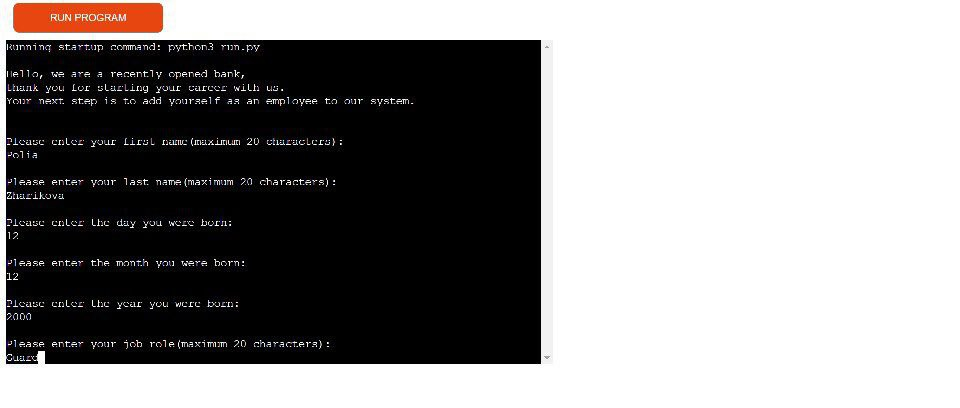
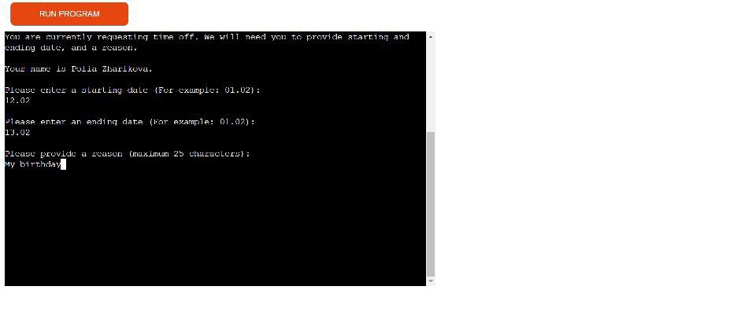
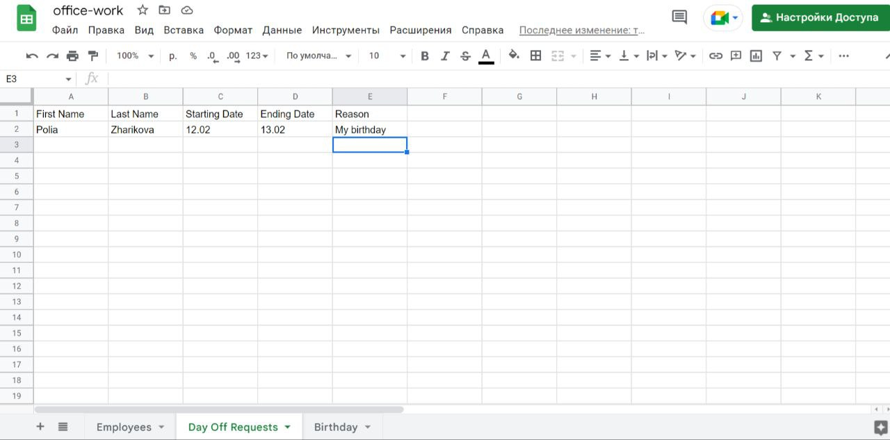
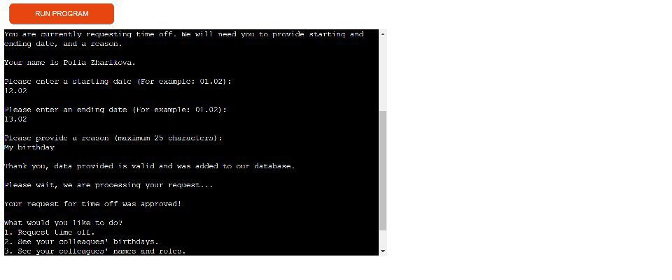
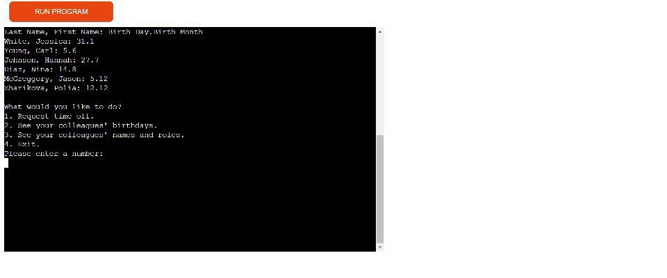
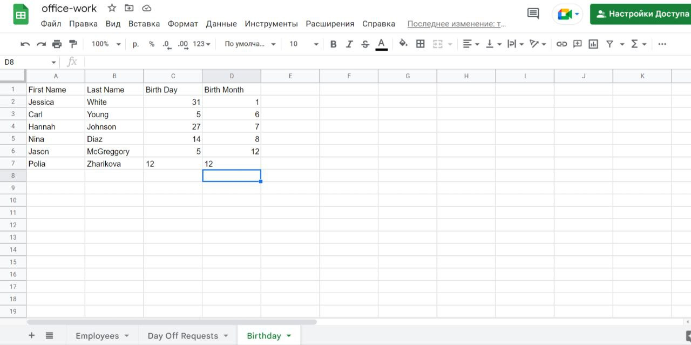
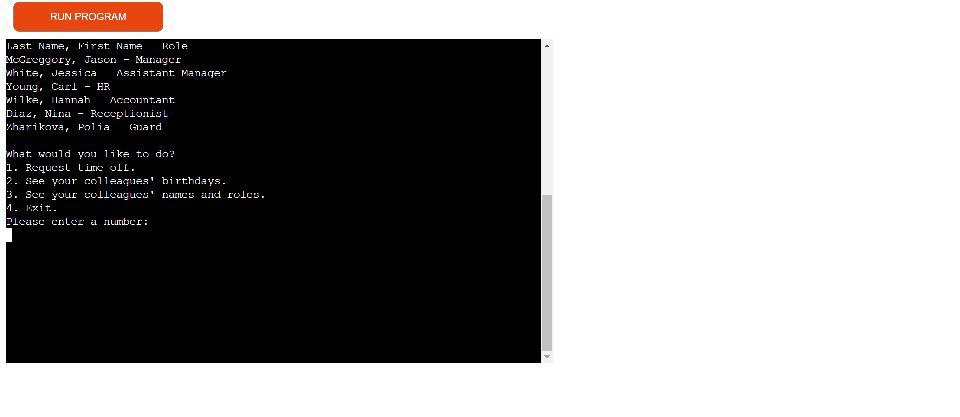
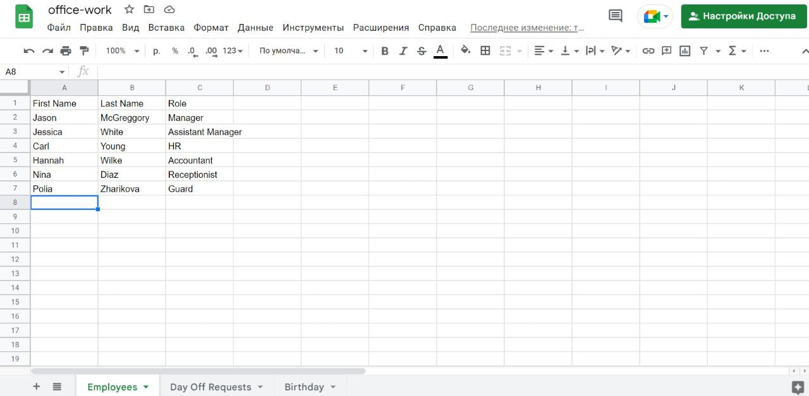
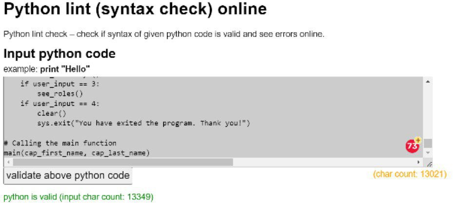
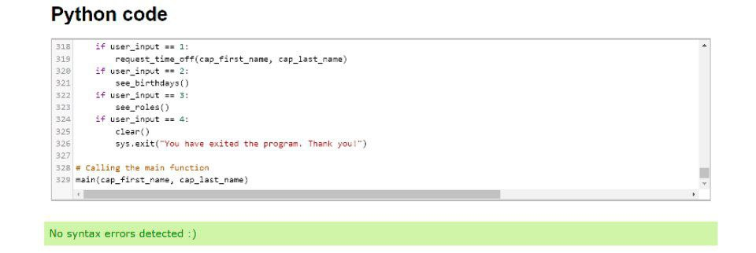

# Bank Job

Bank Job is a program that lets a user register as an employee in a newly opened bank. Then gives options on what to do next: request time off, see colleagues birthdays or roles, or exit.

The live link to the program: https://pol-bank-job.herokuapp.com/

The link to my spreadsheet: https://docs.google.com/spreadsheets/d/11l1zjbqZfBe5d8x0NezmQfyXGqYsxjuygrjwLQOcd6s/edit#gid=0

# Existing features

## Introduction and registering to be an employee

This section contains brief introduction to make program's theme clear. Then asks user to register in the system.

Inputs ask for first and last name, date of birth and job role. 

String inputs are checked for:

-length being higher than 20 and lower than 1;

-being a number or null;

-being an unalphabetic character.

Number inputs are checked for:

-birth day being higher than 31 or lower than 1;

-birth month being higher than 12 or lower than 1;

-then program calculates exact age based on the year input, if user is underage or older than 80, then they have to try again.

Then worksheet gets updated and the menu appears that asks user what they want to do. Options are:
1. Request time off.
2. See your colleagues' birthdays.
3. See your colleagues' names and roles.
4. Exit.

## Request time off

Program states user's name, that they are requesting time off and what information will be needed (starting date, ending date and a reason).

Dates are checked for:

-being higher than 31.12 or lower than 01.01;

-being an integer;

-numbers after comma being exactly two and being higher than 12;

-being null.

Reason is checked for:

-length being higher than 25 or lower than 1;

-being numeric or having special characters;

-being null.

Once the user completes requesting, worksheet is updated and program gets a random number between 1 and 10 to approve or disapprove the request.

If even number comes up, user gets approval.
If uneven number does, user gets disapproval and gets asked if they want to challenge it. 

Challenge input is checked for:

-being anything other than Y or N.

If their input is Y, they get a message that someone will contact them soon and then the menu appears, asking user what they want to do.
If their input was N, they get a thank you message and the menu appears.

## See your colleagues' birthdays
Program first states how colleagues' birthday will be printed out and then prints them out.

Data is taken from birthdays list in the worksheet.

## See your colleagues' names and roles

Program first states how data will be printed out and then prints it out.

Data is taken from employees list in the worksheet.

## Exit

When user enters number 4, terminal clears and then prints out a thank you message.

# Frameworks and libraries used

Google Spreadsheet to store data.

Google Cloud to set up APIs.

Google Drive API to get credentials to access google files from the drive.

Google Sheets API to access and update the spreadsheet.

gspread to access and update data in the Google Sheet.

Google Auth to set up the authentication needed to access the project.

Time to add pauses.

OS to clear terminal.

Regular Expression (re) to validate strings.

sys to exit the program.

# Testing

I validated code using some webpages.

Although Problems section on gitpod says that there are 58 problems. Most of them is line too long.
I tried making lines smaller, for some lines it helped, for some not.

There was a lot of testing and researching while I was writing the program. Strings and numbers checking for challenging for me, especially floats. Also had a hard time figuring out how to print out birthdays and roles. 

Didn't have while True at first so the program was asking the same question again and again.

The remaining unfixed bug is if user picks request time off option, do what the program tells them then immediately after this user picks the first option again, they will get main menu. Then if they immediately pick 1 once again, they can request time off.

# Deployment

In order to deploy the project I had to insert requirements to requirements.txt and add \n in inputs.

On Heroku:

-name app;

-add config vars;

-add buildpacks;

-synch github to heroku;

-select a repository;

-select deploy.

I also selected automatic deploys.

The live link to the program is: https://pol-bank-job.herokuapp.com/

# Credits

The whole process of connecting spreadsheet to gitpod and update_worksheet function were taken from Love Sandwiches project. 

Adding pause before going on was taken from: 
https://www.pythoncentral.io/pythons-time-sleep-pause-wait-sleep-stop-your-code/

Clearing the terminal was taken from: 
https://stackoverflow.com/questions/2084508/clear-terminal-in-python

Checking strings for special characters was taken from: 
https://stackoverflow.com/questions/57062794/how-to-check-if-a-string-has-any-special-characters

Getting numbers after decimal point was taken from: 
https://stackoverflow.com/questions/3886402/how-to-get-numbers-after-decimal-point